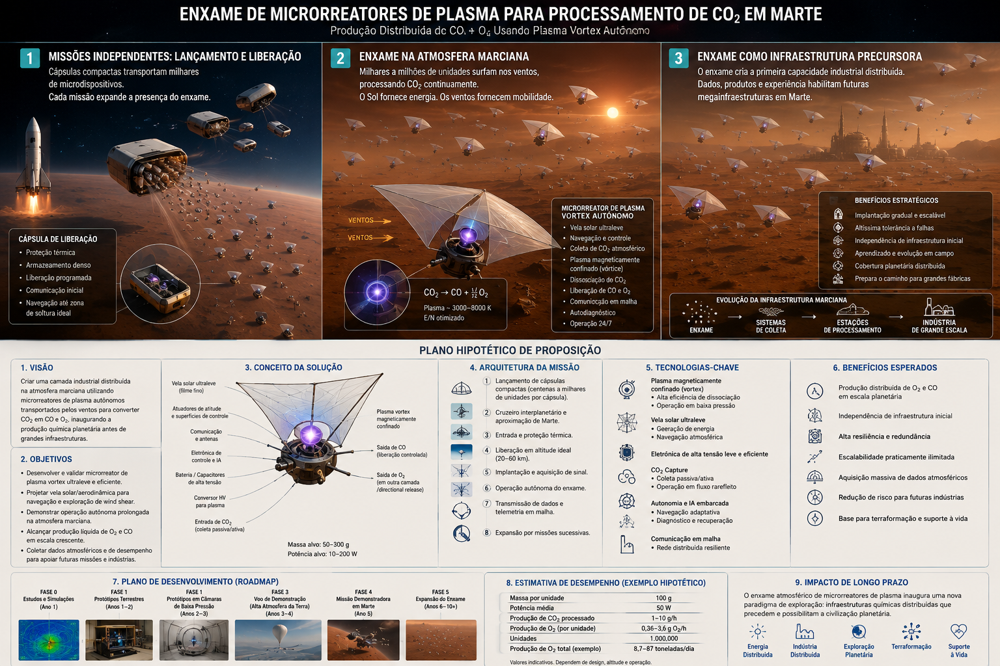
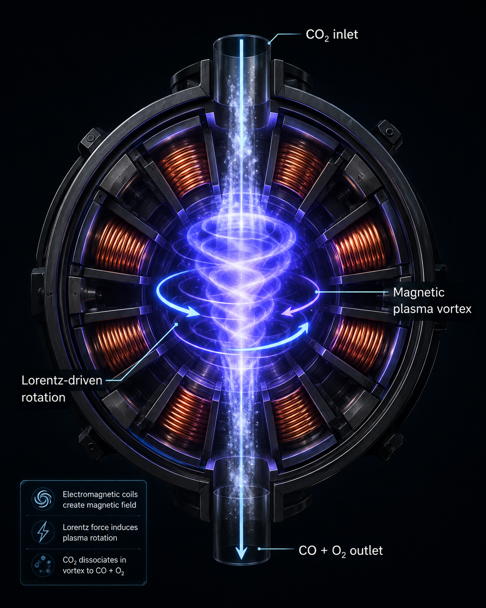
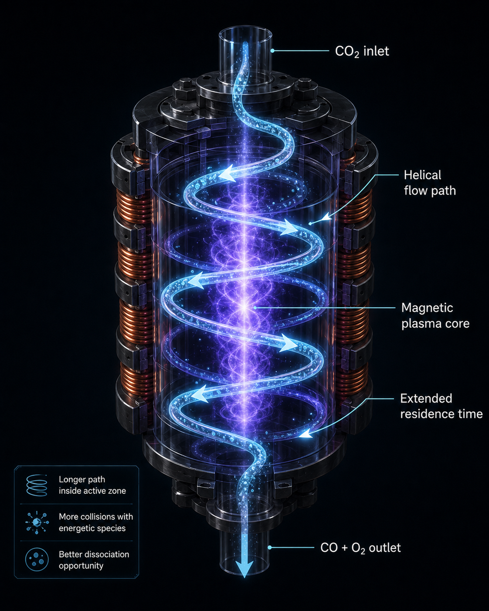
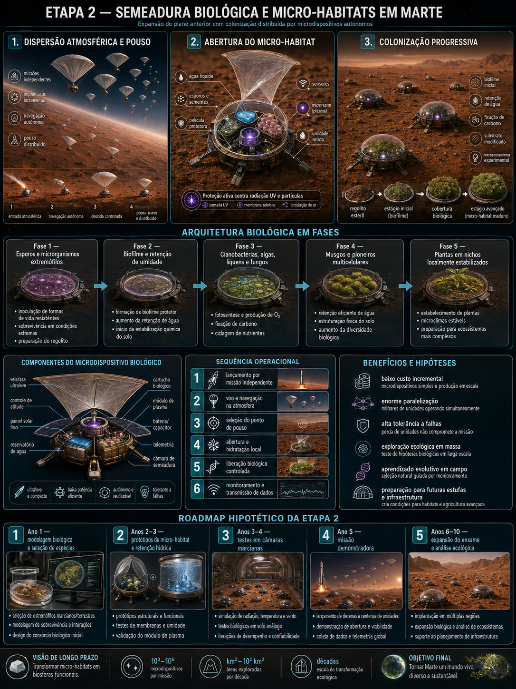

# Distributed Martian Atmospheric CO₂ Processing Swarms

## A Conceptual Architecture for Plasma-Vortex ISRU and Autonomous Microreactors

**J.P. De Luca**

**Version:** 0.2 — Concept Paper  
**Date:** September 2026

> **Status of this work.** This manuscript is a **mental, experimental, and speculative concept study**. It is not a validated mission architecture, demonstrated plasma reactor, terraforming protocol, or engineering specification. The paper deliberately distinguishes (i) experimentally demonstrated facts, (ii) literature-supported physical mechanisms, (iii) engineering extrapolations proposed here, and (iv) long-horizon speculative extensions.
>
> **AI-assisted development note.** This concept was developed through iterative human–AI dialogue. “G.P. Trevisan Sole” was used informally during development as a pseudonym for the AI collaborator. For formal scholarly publication, **J.P. De Luca is the responsible author**; AI assistance is disclosed in the dedicated statement near the end of this manuscript.

---

## Abstract

Mars provides an unusually abundant local carbon dioxide resource but imposes severe constraints on mass transport, power generation, atmospheric flight, and biological activity. This concept paper explores a distributed alternative to large, infrastructure-dependent oxygen-production plants: very large swarms of autonomous, ultralight atmospheric microdevices that locally process Martian CO₂ using compact plasma reactors. The conceptual reactor evolved from an initially proposed Tesla-coil-like free discharge toward a magnetically influenced, vortex-stabilized flow geometry intended to increase gas–plasma contact, residence time, and controllability. The preferred near-term chemical objective is not complete decomposition to elemental carbon and oxygen, but the better-supported reaction $2CO_2 \rightarrow 2CO + O_2$, followed by rapid quenching and, where practical, product separation. The swarm architecture is motivated by incremental deployment, massive parallelism, graceful degradation, and compatibility with independent precursor missions. A second, substantially more speculative stage considers landed micro-habitats containing water and pioneer phototrophs rather than direct open-air seed dispersal. The paper compares discarded and retained concepts, develops first-order mass and energy bounds, identifies dominant feasibility gaps, and proposes a staged research program. The result is best interpreted as a research hypothesis and architecture-generation exercise rather than a mission proposal.

**Keywords:** Mars; ISRU; carbon dioxide; oxygen production; non-thermal plasma; gliding arc; plasma vortex; swarm robotics; atmospheric vehicles; distributed systems; cyanobacteria; planetary protection

---

## 1. Introduction

Long-duration operations on Mars benefit strongly from **in-situ resource utilization (ISRU)** because every kilogram of oxygen, propellant, water, structure, and consumable produced locally reduces dependence on terrestrial launch mass. Oxygen is especially important because it serves both life-support and propulsion roles. The Mars Oxygen ISRU Experiment (MOXIE) demonstrated on Mars that atmospheric CO₂ can be electrochemically converted into molecular oxygen and carbon monoxide using solid-oxide electrolysis [3,4]. MOXIE therefore establishes the central premise that the Martian atmosphere can be treated as an industrial feedstock, while leaving open the question of what other architectures might complement or eventually compete with centralized solid-oxide systems.

This study began from the idealized decomposition

$$
\mathrm{CO_2 \rightarrow C + O_2}
$$

and then explored whether electrical plasma could provide a practical activation pathway. The concept subsequently evolved through several discarded architectures:

1. free Tesla-coil-like discharges into ambient CO₂;
2. direct plasma treatment of solid CO₂;
3. large wind-powered plasma towers near polar CO₂ deposits;
4. combined turbine/plasma towers;
5. free-flying wind-powered microturbines.

The preferred concept became a **distributed atmospheric swarm** of ultralight devices carrying compact, vortex-stabilized plasma reactors, primarily solar-powered and transported or navigated through Martian atmospheric circulation.

A second speculative extension asks whether the same deployable platform could later carry biological payloads. Directly spraying terrestrial seeds and liquid water into the Martian environment was rejected as physically and biologically weak. It was replaced by the concept of **contained micro-habitats** designed to retain water and protect pioneer microorganisms or phototrophs.

The project therefore consists of two concept layers:

$$
\boxed{\text{Stage 1: Distributed physicochemical CO₂ processing}}
$$

$$
\boxed{\text{Stage 2: Speculative protected biological micro-habitats}}
$$

Stage 1 is an engineering research hypothesis. Stage 2 is a far-future astrobiological thought experiment and, under current planetary-protection principles, must remain a contained experimental concept rather than an open-release proposal [13].

---

## 2. Justification and Identification of Needs

### 2.1 Oxygen as a strategic Martian resource

A local oxygen-production system can support:

- breathing and habitat atmosphere management;
- oxidizer production for ascent or surface propulsion;
- metallurgy and high-temperature processing;
- chemical synthesis;
- redundancy for future human infrastructure.

MOXIE produced oxygen directly from the Martian atmosphere and ultimately demonstrated production rates up to approximately 12 g h⁻¹ with purity of at least 98% during its mission [4]. The experiment is a crucial benchmark because it establishes that atmospheric ISRU is not merely theoretical.

The swarm concept does **not** assume that plasma must outperform solid-oxide electrolysis. Rather, it asks a different architectural question:

> Can low-throughput chemical processing become useful when it is embedded in an enormous number of cheap, independently deployable atmospheric devices?

This is fundamentally a **scale-out** hypothesis rather than a scale-up hypothesis.

---

### 2.2 Why distributed systems?

A large stationary refinery can achieve high throughput but typically depends on:

- heavy cargo landing;
- site preparation;
- stable high-power generation;
- construction or deployment of large structures;
- local maintenance and replacement infrastructure;
- prior reconnaissance and logistics.

A swarm architecture trades unit efficiency for deployment flexibility:

| Property | Distributed swarm | Large fixed plant |
|---|---:|---:|
| Initial infrastructure dependence | Low | High |
| Independent mission deployment | High | Low |
| Fault tolerance | High | Low–medium |
| Incremental scaling | Excellent | Stepwise |
| Per-unit throughput | Low | High |
| Maintenance efficiency | Low | High |
| Technology refresh | Generation-by-generation | Slow |
| Geographic coverage | Planetary | Local |
| Scientific sensing value | Very high | Local |

The central strategic hypothesis is therefore:

$$
\boxed{
\text{For early Mars development, survivable low-throughput units may be useful before high-throughput infrastructure is practical.}
}
$$

---

### 2.3 Why investigate plasma?

CO₂ is chemically stable and its dissociation requires substantial energy. Non-equilibrium plasmas are attractive because electron energies can greatly exceed the bulk-gas thermal energy, enabling excitation, ionization, and dissociation without requiring the entire gas volume to reach the same temperature [5–8].

The literature identifies several relevant plasma families, including:

- dielectric-barrier discharge (DBD);
- microwave plasma;
- gliding arc;
- rotating or vortex-assisted gliding arc;
- radio-frequency discharges;
- plasma–catalyst hybrid systems [5–9].

Plasma conversion remains at low technology readiness relative to mature industrial chemistry, and recent reviews emphasize the gap between laboratory performance and industrialization [5]. The present paper treats that limitation as central rather than incidental.

---

## 3. Study and Analysis of the Martian Context

### 3.1 Atmospheric environment

Mars has a thin, CO₂-dominated atmosphere. A NASA engineering reference gives a representative surface atmospheric density of approximately

$$
\rho_{\mathrm{Mars}} \approx 0.020\ \mathrm{kg\,m^{-3}}
$$

and an average solar irradiance above the atmosphere of approximately

$$
I_{\mathrm{Mars}} \approx 590\ \mathrm{W\,m^{-2}}
$$

[10].

These two numbers strongly shape the architecture.

The low density makes the atmosphere chemically abundant in **composition** but sparse in **mass per volume**. At the same time, solar power remains significant enough to justify thin-film photovoltaics as a primary energy source.

---

### 3.2 Why wind is better treated as transportation than primary power

The ideal kinetic power available in a flow is

$$
P_{\mathrm{wind}}=\frac{1}{2}\rho A v^3 .
$$

Because $P_{\mathrm{wind}}$ scales linearly with density, Mars' low atmospheric density strongly penalizes small wind-energy harvesters. Historical NASA analyses found conventional Martian wind power unattractive for near-term surface power under representative atmospheric conditions [11].

An additional problem appears for **free-drifting** devices. A balloon or passive vehicle that accelerates until its velocity approaches the local air velocity experiences decreasing relative wind:

$$
v_{\mathrm{rel}} = v_{\mathrm{air}}-v_{\mathrm{vehicle}}
$$

and, for an ideal passive drifter,

$$
v_{\mathrm{rel}}\rightarrow 0 .
$$

Thus the atmospheric flow can remain useful for:

- transportation;
- trajectory control;
- vertical or horizontal shear exploitation;
- passive geographic distribution;

while being a poor assumption for continuous standalone energy generation.

The preferred architecture therefore evolved toward

$$
\boxed{\text{solar energy for chemistry} + \text{wind for transport/navigation}}
$$

rather than wind-only microturbines.

---

### 3.3 Aerostatic and aerodynamic flight constraints

Mars balloon concepts have been studied experimentally, including superpressure-balloon deployment tests in Earth's stratosphere as a Martian analog [12]. JPL work on Martian superpressure balloons illustrates an important scaling constraint: very low ambient density leads to large envelope volumes relative to payload mass.

A useful first-order buoyancy estimate is

$$
F_b \approx (\rho_{\mathrm{CO_2}}-\rho_{\mathrm{lift}})Vg .
$$

For an ultralight lifting gas, the ideal net mass capacity is only on the order of tens of grams per cubic metre near representative surface density. Therefore a "small device" may still require a **large-area ultrathin envelope**.

This is why the concept should not be interpreted as millions of centimeter-scale balloons. More plausible geometries include:

- ultrathin superpressure envelopes;
- solar/aerodynamic hybrid sails;
- collapsible lifting surfaces;
- devices operating at selected pressure/altitude regimes;
- periodic rather than indefinite flight.

The exact flight architecture remains an unresolved subsystem.

---

### 3.4 Polar solid CO₂ versus atmospheric CO₂

An early branch of the concept proposed using Martian polar CO₂ ice. Solid CO₂ is attractive as a concentrated feedstock but does not inherently make molecular dissociation easier.

For plasma processing, the likely sequence is

$$
\mathrm{CO_2(s)\rightarrow CO_2(g)\rightarrow plasma\ processing}.
$$

The solid phase therefore acts more naturally as:

- stored feedstock;
- a source for controlled sublimation;
- a way to create a denser reactor feed stream.

However, polar processing reintroduces centralized infrastructure and transport requirements. The final swarm concept instead prioritizes **ubiquitous atmospheric feedstock**, accepting lower local density in exchange for global availability and no mining phase.

---

## 4. Thermodynamic and Chemical Baseline

### 4.1 Complete decomposition

The idealized full reaction is

$$
\mathrm{CO_2(g)\rightarrow C(s)+O_2(g)}.
$$

Using standard thermochemical data for CO₂, the reverse of carbon combustion has a standard enthalpy requirement of approximately

$$
\Delta H^\circ \approx +393.5\ \mathrm{kJ\,mol^{-1}}
$$

[1].

With a molar mass of approximately

$$
M_{\mathrm{CO_2}}=44.01\ \mathrm{g\,mol^{-1}},
$$

the corresponding ideal enthalpy scale is

$$
\frac{393.5\ \mathrm{kJ\,mol^{-1}}}{0.04401\ \mathrm{kg\,mol^{-1}}}
\approx 8.94\ \mathrm{MJ\,kg^{-1}_{CO_2}}.
$$

The mass balance is

$$
44\ \mathrm{kg\ CO_2}
\rightarrow
12\ \mathrm{kg\ C}
+
32\ \mathrm{kg\ O_2}.
$$

Therefore, at complete decomposition,

$$
1\ \mathrm{kg\ CO_2}
\rightarrow
0.727\ \mathrm{kg\ O_2}.
$$

This route maximizes oxygen recovered per unit mass of CO₂, but it is **not** the preferred first experimental target because direct formation and controlled collection of elemental carbon introduce additional plasma-chemistry and surface-engineering problems.

---

### 4.2 Partial dissociation to carbon monoxide

The more established target reaction is

$$
\mathrm{CO_2\rightarrow CO+\frac{1}{2}O_2}.
$$

Using NIST standard formation enthalpies for CO₂ and CO [1,2],

$$
\Delta H^\circ
\approx
(-110.53)-(-393.51)
=
+282.98\ \mathrm{kJ\,mol^{-1}}.
$$

Therefore,

$$
\frac{282.98}{0.04401}
\approx
6.43\ \mathrm{MJ\,kg^{-1}_{CO_2}}.
$$

The mass balance is

$$
44\ \mathrm{kg\ CO_2}
\rightarrow
28\ \mathrm{kg\ CO}
+
16\ \mathrm{kg\ O_2},
$$

so

$$
1\ \mathrm{kg\ CO_2}
\rightarrow
0.364\ \mathrm{kg\ O_2}.
$$

This is the preferred Stage-1 reaction because it matches both established plasma-conversion literature and the reaction demonstrated electrochemically by MOXIE.

---

### 4.3 Oxygen atoms are intermediates, not the intended exhaust product

Several conceptual illustrations show an outlet labeled "CO + O". This should be interpreted as a visualization of **reactive plasma products**, not the desired macroscopic exhaust composition.

A simplified plasma pathway is

$$
e^- + CO_2 \rightarrow CO + O + e^-,
$$

followed by oxygen recombination such as

$$
O+O+M\rightarrow O_2+M.
$$

The engineering target is therefore better written as

$$
\boxed{
2CO_2 \rightarrow 2CO+O_2
}
$$

after quenching and recombination control.

This distinction is important: atomic oxygen is highly reactive and should not be treated as a stable stored product.

---

## 5. Functional Synthesis

### 5.1 Stage 1 functional chain

The adopted functional architecture is:

$$
\text{Atmospheric CO}_2
\rightarrow
\text{intake}
\rightarrow
\text{flow conditioning}
\rightarrow
\text{plasma-vortex core(s)}
\rightarrow
\text{quench}
\rightarrow
\text{CO/O}_2\text{-rich exhaust}
\rightarrow
\text{optional separation}
$$

Each unit would ideally provide:

1. **energy collection** — primarily solar;
2. **attitude/navigation control**;
3. **CO₂ intake and flow conditioning**;
4. **high-voltage/RF power conversion**;
5. **plasma generation and magnetic-field control**;
6. **gas residence-time management**;
7. **quenching**;
8. **telemetry and diagnostics**;
9. **autonomous degradation/failure handling**.

---

### 5.2 Plasma-vortex hypothesis

The concept was inspired by magnetically influenced plasma-vortex demonstrations and by the broader literature on vortex/gliding-arc reactors. It should **not** be interpreted as a claim that the exact ring-coil geometry illustrated here has already been demonstrated for Martian CO₂ conversion.

The governing charged-particle force is

$$
\mathbf F=q(\mathbf E+\mathbf v\times\mathbf B).
$$

A magnetic field can alter electron and ion trajectories and can participate in shaping or rotating a discharge. Neutral CO₂ molecules, however, are not directly forced into macroscopic rotation by the magnetic field. Their coupling occurs through:

- collisions with charged and excited species;
- gas heating;
- pressure gradients;
- electrohydrodynamic effects;
- deliberately imposed aerodynamic swirl.

Thus the preferred reactor concept combines two distinct mechanisms:

$$
\boxed{
\text{magnetically organized plasma}
+
\text{aerodynamically conditioned neutral-gas flow}
}
$$

rather than assuming direct magnetic control of neutral CO₂.

---

### 5.3 Reduced electric field

A central plasma parameter is the reduced electric field

$$
\frac{E}{N},
$$

where $E$ is electric-field strength and $N$ is gas number density. It is commonly expressed in Townsend:

$$
1\ \mathrm{Td}=10^{-21}\ \mathrm{V\,m^2}.
$$

$E/N$ influences the electron-energy distribution and therefore the fraction of input energy directed into:

- rotational excitation;
- vibrational excitation;
- electronic excitation;
- ionization;
- dissociation.

The plasma literature emphasizes that vibrational activation can be particularly relevant for CO₂ conversion [5–8].

---

### 5.4 Residence time and helical flow

The conceptual advantage of a vortex geometry is not merely visual rotation. The engineering objective is to increase the effective interaction time

$$
\tau
$$

between the gas stream and the active plasma region.

A representative helical path can be parameterized as

$$
x(t)=r\cos(\omega t),
$$

$$
y(t)=r\sin(\omega t),
$$

$$
z(t)=v_z t.
$$

The actual gas trajectory would depend on reactor geometry and fluid dynamics, but this representation captures the design intent: a longer path through a compact active zone.

---

### 5.5 Sequential vortex stages

Rather than increasing one reactor indefinitely, the concept favors modular stages:

$$
\mathrm{CO_2}
\rightarrow
V_1
\rightarrow
V_2
\rightarrow
V_3
\rightarrow
\mathrm{quench}.
$$

Potential advantages include:

- incremental specific-energy input;
- easier thermal management;
- measurable conversion after each stage;
- graceful degradation when one stage fails;
- standardized manufacturing.

The effect on conversion is not assumed to be linear. Additional stages may also increase:

- recombination;
- thermal losses;
- pressure drop;
- electrode or wall erosion.

This is therefore an empirical optimization variable.

---

## 6. Concept Generation and Sketches

### 6.1 Concept evolution

| Concept | Decision | Primary reason |
|---|---|---|
| Direct $CO_2\rightarrow C+O_2$ | Retained as ideal thermodynamic endpoint | Highest theoretical O₂ recovery; useful benchmark |
| Tesla-coil free discharge | Rejected as primary reactor | Poor gas contact, residence-time control, and product capture |
| Solid CO₂ directly in plasma | Rejected as preferred reaction state | Plasma chemistry primarily benefits from gas-phase feed |
| Polar fixed refinery | Retained as future centralized comparison | High feedstock concentration, but large infrastructure burden |
| Wind turbine + Tesla tower | Deprioritized | Low Martian wind power density and poor chemical control |
| Turbine and plasma on same tower | Deprioritized | Still centralized; subsystem functions unnecessarily coupled |
| Vortex/gliding-arc-inspired reactor | Retained | Literature-supported class; improved gas–plasma interaction |
| Magnetically organized plasma core | Retained as research hypothesis | Potential discharge shaping and compact geometry |
| Multiple reactor cores | Retained | Modular scale-out and progressive conversion |
| Free atmospheric swarm | Retained as system architecture | Incremental deployment and fault tolerance |
| Wind-only flying generator | Rejected | Passive drifter loses relative wind; low density |
| Solar + atmospheric transport | Retained | Better separation of energy and mobility functions |
| Open spraying of water/seeds | Rejected | Poor water stability and biological survivability |
| Protected biological micro-habitats | Retained as speculative Stage 2 | Physically and biologically more coherent |

---

### 6.2 Figure 1 — Stage-1 system plan

**Figure 1.** Conceptual Stage-1 architecture: independent delivery missions release large numbers of autonomous atmospheric units; the swarm performs distributed CO₂ processing and atmospheric sensing; later generations could become a precursor layer for more conventional infrastructure.

**Interpretation.** The key contribution of this figure is architectural rather than mechanical. It visualizes **incremental deployment**: no single mission must deliver the entire system, and no single device is mission-critical.

---

### 6.3 Figure 2 — CO₂ flow through plasma-vortex cores

**Figure 2.** Conceptual process flow through one or more plasma-vortex stages.

**Correction to the illustration.** Labels showing "CO + O" represent short-lived reactive products near the plasma. The preferred stable bulk target after quenching is $CO+O_2$, consistent with

$$
2CO_2\rightarrow 2CO+O_2.
$$

**Interpretation.** The figure captures the core reactor hypothesis: the gas is **forced through a controlled energetic volume** instead of being incidentally struck by a free discharge.

---

### 6.4 Figure 3 — Detailed magnetic plasma-vortex concept

**Figure 3.** Conceptual ring-coil plasma-vortex geometry.

**Interpretation.** This is an **engineering sketch, not an experimentally validated reactor geometry**. Its research value is to define questions that can be measured: field topology, discharge stability, gas-flow distribution, residence time, wall interaction, and conversion efficiency.

---

### 6.5 Figure 4 — Helical gas-flow reactor

**Figure 4.** Conceptual helical flow path surrounding or intersecting a plasma core.

**Interpretation.** The purpose of the helical path is to increase interaction length without simply making the reactor longer. CFD and plasma-fluid simulations would be required to determine whether the geometry actually improves conversion per unit energy.

---

### 6.6 Figure 5 — Atmospheric swarm

**Figure 5.** Artistic visualization of a distributed swarm of atmospheric units transported above the Martian surface.

**Interpretation.** The image intentionally exaggerates visibility and density of the swarm. Real vehicles would be constrained by buoyancy, solar area, mass, dust, communications, and atmospheric circulation. The figure illustrates the **distributed topology**, not a final flight vehicle.

---

### 6.7 Figure 6 — Stage-2 biological micro-habitats

**Figure 6.** Speculative second-stage architecture in which selected devices land and create protected micro-habitats carrying water and pioneer biological systems.

**Interpretation.** This replaces the rejected idea of directly broadcasting seeds and liquid water. Candidate phototrophs such as cyanobacteria are relevant to closed or protected Martian life-support research because they can convert CO₂ and water into biomass and O₂ under engineered conditions [14–17]. This figure must not be read as an endorsement of open biological release on Mars.

---

## 7. First-Order Scaling Analysis

### 7.1 Reaction-energy floor per unit

For the partial reaction

$$
CO_2\rightarrow CO+\frac{1}{2}O_2,
$$

the ideal enthalpy requirement is approximately

$$
6.43\ \mathrm{MJ\,kg^{-1}_{CO_2}}.
$$

For a unit processing

$$
\dot m=1\ \mathrm{g\,h^{-1}},
$$

the reaction-enthalpy rate is

$$
P_{\mathrm{chem,ideal}}
=
\frac{6.43\times10^6\times10^{-3}}{3600}
\approx
1.79\ \mathrm{W}.
$$

At

$$
10\ \mathrm{g\,h^{-1}},
$$

the ideal value becomes approximately

$$
17.9\ \mathrm{W}.
$$

These are **thermodynamic floors**, not electrical input requirements. Real plasma systems must also pay for:

- power electronics;
- incomplete conversion;
- ionization and nonproductive excitation;
- heat loss;
- compression/flow conditioning;
- quenching;
- communications and navigation.

Thus a hypothetical 10–200 W electrical device processing approximately 1–10 g h⁻¹ of CO₂ should be treated as an **exploratory design envelope**, not a performance prediction.

---

### 7.2 Atmospheric volumetric flow

Using a representative total atmospheric density

$$
\rho\approx0.020\ \mathrm{kg\,m^{-3}}
$$

and assuming approximately 95% of the atmospheric mass stream is CO₂ for a first-order estimate, processing $1\ \mathrm{g\,h^{-1}}$ of CO₂ requires an ambient volume on the order of

$$
\dot V
\approx
\frac{0.001}{0.95\times0.020}
\approx
0.053\ \mathrm{m^3\,h^{-1}}
$$

or approximately

$$
1.5\times10^{-5}\ \mathrm{m^3\,s^{-1}}
\approx
0.015\ \mathrm{L\,s^{-1}}.
$$

At $10\ \mathrm{g\,h^{-1}}$, the corresponding first-order value is roughly

$$
0.15\ \mathrm{L\,s^{-1}}.
$$

These volumetric values are modest, but the gas is at very low pressure. Reactor breakdown, plasma regime, heat transfer, compressor requirements, and residence time therefore remain the dominant questions.

---

### 7.3 Swarm output arithmetic

For a hypothetical swarm of

$$
N=10^6
$$

units each fully converting

$$
1\ \mathrm{g\,h^{-1}}
$$

of CO₂ through the partial dissociation route, total feed conversion is

$$
1000\ \mathrm{kg\,h^{-1}}
=
24,000\ \mathrm{kg\,day^{-1}}.
$$

Since the oxygen mass fraction recovered from converted CO₂ is

$$
\frac{16}{44}=0.364,
$$

the ideal oxygen production would be

$$
24,000\times0.364
\approx
8.7\times10^3\ \mathrm{kg\,day^{-1}}
$$

or approximately

$$
8.7\ \mathrm{t\,O_2\,day^{-1}}.
$$

At $10\ \mathrm{g\,h^{-1}}$ per unit, the arithmetic scales to approximately

$$
87\ \mathrm{t\,O_2\,day^{-1}}.
$$

These values illustrate the **parallelism argument only**. They do not establish that one million operational devices, 100% conversion, continuous power, sustained flight, or product retention are feasible.

---

## 8. Feasibility Analysis

### 8.1 Evidence hierarchy

To avoid conflating established science with the proposed architecture, the concept is divided into evidence tiers.

#### Tier A — Demonstrated

- Martian atmospheric CO₂ can be processed into O₂ using solid-oxide electrolysis [3,4].
- Non-equilibrium plasma can dissociate CO₂ in terrestrial laboratory reactors [5–9].
- Balloon technologies have been developed and tested in low-density terrestrial analog environments relevant to Mars [12].
- Cyanobacteria can be investigated under Mars-relevant low-pressure atmospheres and regolith-simulant conditions inside engineered systems [14–17].

#### Tier B — Literature-supported but not demonstrated as proposed

- Vortex/gliding-arc flow can improve interaction between plasma and CO₂ in specific reactor configurations [8,9].
- Plasma conversion can potentially be modular and coupled to renewable electricity [5–7].

#### Tier C — Engineering extrapolation introduced here

- An ultralight atmospheric vehicle carrying a compact magnetic/vortex plasma reactor.
- Millions of independently deployed reactors acting as a chemical swarm.
- Sequential miniature plasma-vortex cores optimized for Martian low-pressure flow.
- Planet-wide incremental deployment by unrelated precursor missions.

#### Tier D — Highly speculative

- Atmosphere-scale oxygen accumulation from the swarm.
- Long-duration self-maintaining atmospheric "chemical plankton."
- Stage-2 deployment of protected biological micro-habitats on Mars.
- Any open ecological transformation or terraforming outcome.

---

### 8.2 Plasma feasibility

The central unknown is **energy efficiency under Mars-relevant pressure and microreactor scale**.

A useful experimental figure of merit is

$$
\eta_E=
\frac{\text{chemical energy stored in products}}
{\text{electrical energy supplied to the complete reactor system}}.
$$

The literature cautions that reported plasma efficiencies can be difficult to compare because authors may use different definitions and system boundaries [6]. Any serious follow-up must therefore report at least:

- CO₂ conversion $X_{CO_2}$;
- energy efficiency $\eta_E$;
- specific energy input;
- gas pressure and temperature;
- flow rate;
- residence time;
- plasma power;
- total wall-plug power;
- product composition;
- carbon balance;
- oxygen balance.

This is essential if a swarm concept is ever to be compared fairly with SOEC/MOXIE-type systems.

---

### 8.3 Quenching and recombination

Producing dissociation products is not enough. Hot CO, O, O₂, electrons, and excited species can recombine.

The reactor therefore requires a controlled post-plasma region:

$$
\text{plasma}
\rightarrow
\text{rapid quench}
\rightarrow
\text{stable product stream}.
$$

Quenching can improve preservation of nonequilibrium products, but excessive cooling hardware adds mass. In a flying microdevice, the tension between **chemical conversion** and **thermal rejection** may dominate the design.

---

### 8.4 Product separation

A further unresolved question is whether each flying unit should separate CO from O₂.

Possible architectures include:

1. **No onboard separation** — lowest mass, highest recombination risk.
2. **Partial differential exhaust** — use flow geometry to spatially separate streams.
3. **Membrane/electrochemical separation** — potentially efficient but adds mass and complexity.
4. **Collector stations** — atmospheric devices process gas but periodically deliver product or data to larger infrastructure.

The initial research program should not assume onboard storage. The earliest objective should simply be **measured CO₂ conversion under Martian conditions**.

---

### 8.5 Flight and energy feasibility

The atmospheric platform may be a harder problem than the plasma reactor.

Key unknowns include:

- envelope or sail areal density;
- day/night altitude stability;
- dust loading;
- thermal cycling;
- low-Reynolds-number aerodynamics;
- solar-array degradation;
- energy storage;
- autonomous navigation;
- communications density;
- collision avoidance at extremely large swarm counts.

The term **microdevice** should therefore refer primarily to **payload mass and manufacturing scale**, not necessarily physical envelope diameter.

---

### 8.6 Stage-2 biological feasibility

Oxygenic photosynthesis can be summarized as

$$
6CO_2+6H_2O+h\nu
\rightarrow
C_6H_{12}O_6+6O_2,
$$

but the liberated $O_2$ originates from water oxidation rather than direct extraction of both oxygen atoms from CO₂.

Cyanobacteria are relevant because selected strains have been investigated for Martian bioregenerative life-support concepts, including low-pressure gas mixtures and regolith-derived nutrients [14–17]. However, exposed Martian surface conditions are not equivalent to those engineered laboratory environments.

Therefore Stage 2 should be formulated as:

$$
\boxed{
\text{sealed or protected micro-habitat experiments}
}
$$

not direct ecological release.

---

### 8.7 Planetary protection

Current COSPAR planetary-protection policy treats Mars as a target requiring stringent controls against harmful forward contamination [13]. An intentional open release of terrestrial organisms would conflict with the scientific and policy logic of present-day planetary protection.

Accordingly:

- Stage 2 is **not a current mission recommendation**;
- any near-term biological work should occur in sealed or recoverable containment;
- the concept is useful today as a design-space exploration for future governance scenarios, closed life-support systems, or Earth-based Mars analog experiments.

---

## 9. Recommended Experimental Program

### Phase 0 — Literature consolidation and numerical model

Develop a reproducible model covering:

- thermodynamic baseline;
- Martian atmospheric properties;
- plasma kinetics;
- $E/N$;
- power balance;
- gas flow;
- heat rejection;
- swarm output scaling.

**Deliverable:** open model + sensitivity analysis.

---

### Phase 1 — Single bench reactor

Construct a terrestrial CO₂ plasma-vortex demonstrator.

Measure:

$$
X_{CO_2},\quad
\eta_E,\quad
T_g,\quad
P,\quad
\dot m,\quad
\tau,\quad
\text{CO/O}_2\text{ composition}.
$$

Compare:

- free arc;
- non-vortex plasma;
- aerodynamic vortex;
- magnetic-field-assisted discharge;
- combined vortex geometry.

**Decision gate:** Does the vortex architecture provide a measurable advantage over a simpler plasma reactor at equal wall-plug energy?

---

### Phase 2 — Low-pressure Mars simulation

Repeat the experiment in a chamber with:

- CO₂-rich gas;
- Mars-relevant pressure range;
- low temperature;
- dust exposure;
- representative flow velocities.

Investigate breakdown behavior and whether a different plasma regime becomes preferable at low pressure.

**Decision gate:** Is direct low-pressure processing practical, or is local compression necessary?

---

### Phase 3 — Multicore reactor

Test sequential cores:

$$
V_1\rightarrow V_2\rightarrow V_3.
$$

Measure conversion and efficiency after every stage.

**Decision gate:** Does modular staging improve conversion per unit total energy and mass?

---

### Phase 4 — Ultralight autonomous carrier

Independently prototype:

- envelope/sail;
- solar generation;
- storage;
- telemetry;
- atmospheric navigation.

The carrier should initially transport an inert dummy reactor.

**Decision gate:** Can the carrier supply the power and mass budget required by the chemistry?

---

### Phase 5 — Integrated terrestrial analog swarm

Deploy tens to hundreds of units in a controlled terrestrial environment.

Objectives:

- swarm communications;
- distributed sensing;
- failure statistics;
- production variance;
- autonomous mission planning;
- recovery and lifecycle analysis.

---

### Phase 6 — Contained biological micro-habitat research

Only as an independent, sealed research branch:

- cyanobacterial photobioreactors;
- water-retention membranes;
- regolith simulants;
- radiation shielding;
- thermal control;
- long-duration ecological stability.

No open release is required to validate the scientific questions.

---

## 10. Discussion

### 10.1 What the concept is really proposing

The strongest idea in this study is **not** that a particular plasma-vortex geometry is already superior to MOXIE.

It is the architectural hypothesis that:

$$
\boxed{
\text{distributed low-throughput ISRU can precede centralized high-throughput ISRU}
}
$$

in the same way distributed computing can provide resilience and geographic reach before centralized infrastructure is available.

The reactor is replaceable. If future experiments show that another technology—SOEC, microwave plasma, DBD, photocatalysis, or a hybrid process—is better at micro-scale, the swarm architecture can survive while the chemical module changes.

This distinction separates:

- the **platform hypothesis** from
- the **reactor hypothesis**.

That modularity should be preserved in future work.

---

### 10.2 Why the large polar plant was not truly rejected

The centralized polar refinery remains attractive for mature Martian industry because it can offer:

- dense feedstock;
- heavy thermal equipment;
- high-capacity separation;
- centralized maintenance;
- efficient product storage.

It was rejected only as the **primary precursor architecture**.

A plausible long-term sequence is therefore:

$$
\text{distributed reconnaissance/process swarm}
\rightarrow
\text{collector stations}
\rightarrow
\text{regional plants}
\rightarrow
\text{large industrial ISRU}.
$$

The swarm and the factory are complementary rather than mutually exclusive.

---

### 10.3 A failure-tolerant deployment philosophy

For $N$ nominally independent devices, system capacity scales approximately with the surviving fraction:

$$
C_{\mathrm{system}}\approx C_{\mathrm{unit}}N(1-f),
$$

where $f$ is the failed fraction.

A monolithic system can have higher component reliability yet still present a single-site failure mode. A swarm can tolerate large absolute numbers of failed units if manufacturing and deployment are sufficiently inexpensive.

This is the central systems-engineering motivation for **massive redundancy**.

---

## 11. Conclusions

This paper develops a speculative Martian ISRU concept through successive elimination and refinement of alternatives.

The main conclusions are:

1. **Direct full splitting of CO₂ to C + O₂ is a useful theoretical endpoint but not the preferred first experimental reaction.**
2. **The nearer-term chemical target should be $2CO_2\rightarrow2CO+O_2$.**
3. **Free Tesla-like discharges are less attractive than confined plasma-flow reactors because they provide poor control of gas interaction and products.**
4. **Vortex or helical flow is interesting primarily because it may improve residence time and plasma–gas coupling.**
5. **A magnetic field acts on charged plasma species, not directly on neutral CO₂; neutral-gas rotation must arise through fluid dynamics and collisional coupling.**
6. **Solid polar CO₂ is better treated as a concentrated feedstock reservoir than as the preferred plasma reaction phase.**
7. **Free-flying wind-only generators are weakened by Mars' low density and by loss of relative wind in passive drift.**
8. **Solar power plus atmospheric transport is a stronger functional separation.**
9. **The central systems hypothesis is a massively parallel swarm that can be deployed incrementally by independent missions.**
10. **The biological extension is substantially more speculative and should be limited to contained micro-habitat research under current planetary-protection constraints.**

The immediate scientific value of the concept is therefore not a claim of planetary oxygen production. It is a falsifiable research question:

> **Can a compact plasma-flow reactor operating under Mars-relevant pressure achieve enough CO₂ conversion per unit wall-plug energy and unit mass to make distributed atmospheric ISRU competitive with, or complementary to, centralized systems?**

Until that question is answered experimentally, all planet-scale production figures should remain clearly identified as scenario arithmetic rather than performance predictions.

---

## 12. Data, Code, and Reproducibility Plan

A publication-ready follow-up should release:

- all order-of-magnitude calculations;
- reactor geometry parameters;
- CFD/plasma simulation inputs;
- raw gas-analysis data;
- power measurements at wall plug;
- uncertainty estimates;
- design files for bench hardware;
- versioned concept figures.

A public repository can function as the living engineering record, while immutable concept-paper versions can be archived separately with DOIs.

---

## 13. AI-Assisted Development Statement

This concept originated through an iterative human–AI design dialogue. **J.P. De Luca** introduced and progressively refined the central hypotheses, including CO₂ decomposition, plasma activation, vortex-flow treatment, distributed atmospheric swarms, and the later biological micro-habitat extension.

During development, the AI collaborator was informally referred to by the project pseudonym **“G.P. Trevisan Sole.”** The generative-AI system assisted with literature-oriented critique, counterexamples, first-order calculations, conceptual organization, comparison of alternative architectures, and generation of schematic illustrations.

For formal scholarly publication, **J.P. De Luca is the sole responsible author** and must independently verify all calculations, references, interpretations, figures, and claims. AI assistance should be disclosed according to the policy of the target repository, conference, or publisher.

---

## References

1. **NIST Chemistry WebBook, SRD 69.** Carbon dioxide, CAS 124-38-9. National Institute of Standards and Technology. Standard gas-phase thermochemistry: $\Delta_f H^\circ_{\mathrm{gas}}\approx -393.51\ \mathrm{kJ\,mol^{-1}}$.

2. **NIST Chemistry WebBook, SRD 69.** Carbon monoxide, CAS 630-08-0. National Institute of Standards and Technology. Standard gas-phase thermochemistry: $\Delta_f H^\circ_{\mathrm{gas}}\approx -110.53\ \mathrm{kJ\,mol^{-1}}$.

3. Hoffman, J. A.; Hecht, M. H.; Rapp, D.; et al. **Mars Oxygen ISRU Experiment (MOXIE)—Preparing for human Mars exploration.** *Science Advances* **2022**, *8*(35), eabp8636. DOI: **10.1126/sciadv.abp8636**.

4. NASA. **NASA’s Oxygen-Generating Experiment MOXIE Completes Mars Mission.** 2023. MOXIE ultimately produced 122 g of oxygen and reached approximately 12 g h⁻¹ at ≥98% purity.

5. Yang, Y.; Murphy, A. B. **CO₂ conversion using non-thermal plasmas: The path towards industrialisation.** *Current Opinion in Green and Sustainable Chemistry* **2025**, *51*, 100994. DOI: **10.1016/j.cogsc.2024.100994**.

6. Wanten, B.; Vertongen, R.; De Meyer, R.; Bogaerts, A. **Plasma-based CO₂ conversion: How to correctly analyze the performance?** *Journal of Energy Chemistry* **2023**, *86*, 180–196. DOI: **10.1016/j.jechem.2023.07.005**.

7. Ashford, B.; Tu, X. **Non-thermal plasma technology for the conversion of CO₂.** *Current Opinion in Green and Sustainable Chemistry* **2017**, *3*, 45–49. DOI: **10.1016/j.cogsc.2016.12.001**.

8. Shah, Y. T.; Verma, J.; Katti, S. S. **Plasma activated catalysis for carbon dioxide dissociation: A review.** *Journal of the Indian Chemical Society* **2021**, *98*(10), 100152. DOI: **10.1016/j.jics.2021.100152**.

9. **Solar–gliding arc plasma reactor for carbon dioxide decomposition: Design and characterization.** *Solar Energy* **2019**. The paper reviews vortex/gliding-arc benchmarks and illustrates the relevance of flow topology to CO₂ plasma conversion.

10. NASA. **NASA/TM—2018-219945.** Mars engineering environment reference values including average irradiance near 590 W m⁻² and representative surface air density near 0.020 kg m⁻³.

11. NASA. **Analysis of Wind Power on Mars.** Technical assessment discussing $P/A=\rho v^3/2$ and the strong limitation imposed by low Martian atmospheric density.

12. NASA Technical Reports Server. **Mars Balloon Flight Test Results.** Stratospheric deployment tests of prototype Mars superpressure balloons under low-density analog conditions; NTRS citation 20150011965.

13. Committee on Space Research (COSPAR). **COSPAR Policy on Planetary Protection.** 2026 edition. Current policy framework for biological and organic contamination control in planetary missions.

14. Verseux, C.; et al. **A Low-Pressure, N₂/CO₂ Atmosphere Is Suitable for Cyanobacterium-Based Life-Support Systems on Mars.** *Frontiers in Microbiology* **2021**, *12*, 611798. DOI: **10.3389/fmicb.2021.611798**.

15. Macário, I. P. E.; et al. **Cyanobacteria as Candidates to Support Mars Colonization: Growth and Biofertilization Potential Using Mars Regolith as a Resource.** *Frontiers in Microbiology* **2022**, *13*, 840098. DOI: **10.3389/fmicb.2022.840098**.

16. Fahrion, J.; Mastroleo, F.; Dussap, C.-G.; Leys, N. **Use of Photobioreactors in Regenerative Life Support Systems for Human Space Exploration.** *Frontiers in Microbiology* **2021**, *12*, 699525. DOI: **10.3389/fmicb.2021.699525**.

17. Rodrigues, D.; McCormick, A. J. **Exploring the biology of cyanobacteria in life support systems on Mars.** *Frontiers in Astronomy and Space Sciences* **2026**, *13*, 1853934. DOI: **10.3389/fspas.2026.1853934**.

---

## Appendix A — Core Equations

### A.1 Wind power

$$
P=\frac12\rho A v^3
$$

### A.2 Lorentz force

$$
\mathbf F=q(\mathbf E+\mathbf v\times\mathbf B)
$$

### A.3 Reduced electric field

$$
E/N
$$

with

$$
1\ \mathrm{Td}=10^{-21}\ \mathrm{V\,m^2}
$$

### A.4 Full CO₂ decomposition

$$
CO_2\rightarrow C+O_2
$$

$$
\Delta H^\circ\approx393.5\ \mathrm{kJ\,mol^{-1}}
$$

$$
1\ \mathrm{kg\ CO_2}\rightarrow0.727\ \mathrm{kg\ O_2}
$$

### A.5 Partial dissociation

$$
CO_2\rightarrow CO+\frac12O_2
$$

$$
\Delta H^\circ\approx283.0\ \mathrm{kJ\,mol^{-1}}
$$

$$
1\ \mathrm{kg\ CO_2}\rightarrow0.364\ \mathrm{kg\ O_2}
$$

### A.6 Helical conceptual path

$$
x(t)=r\cos(\omega t)
$$

$$
y(t)=r\sin(\omega t)
$$

$$
z(t)=v_zt
$$

### A.7 Idealized swarm throughput

$$
\dot m_{\mathrm{total}}=N\dot m_{\mathrm{unit}}
$$

and, for complete conversion through the CO route,

$$
\dot m_{O_2}\approx0.364\,\dot m_{CO_2}.
$$

---

## Appendix B — Suggested Next Quantitative Paper

A follow-up paper should narrow the scope to one falsifiable engineering question:

> **Energy and mass feasibility of a Mars-pressure plasma-vortex microreactor for $CO_2\rightarrow CO+\frac12O_2$.**

Recommended sections:

1. Boltzmann/electron-energy model versus $E/N$;
2. Mars-pressure discharge regime selection;
3. axisymmetric or 3-D CFD/MHD model;
4. residence-time distribution;
5. heat balance;
6. power-electronics efficiency;
7. conversion and energy-efficiency map;
8. comparison against optimized SOEC/MOXIE-class systems;
9. carrier mass/power envelope;
10. sensitivity analysis identifying the parameter that most strongly determines swarm viability.

That paper would move the project from **concept architecture** toward a **refereeable engineering hypothesis**.
